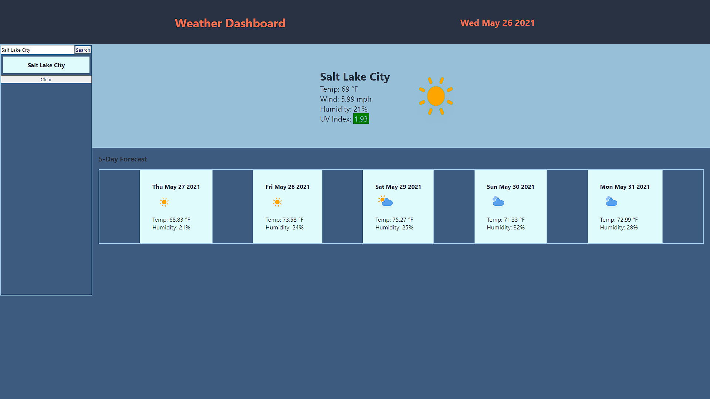
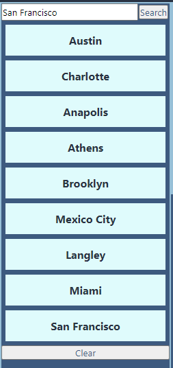

# OpenWeatherMap Dashboard

## Overview

In this exercise, the user is tasked with creating an application that takes in the name of a city in the United States and return current weather information and a 5 day forecast. Using the OpenWeatherMap API, appropriate JSON data is extracted and displayed.

## Table of Contents

  - [Pseudocode](#pseudocode)
  - [Installation](#installation)
  - [Usage](#usage)
  - [Technologies Used](#technologies-used)
  - [Links](#links)
  - [Resources](#resources)
  - [Screenshots](#screenshots)
    - [Weather Dashboard](#weather-dashboard)
    - [Search Bar](#search-bar)

## Pseudocode

1. Create a search bar section, a current weather section, and a 5 day section.
2. Implement a way to capture the value of saved items to restore their value.
3. Fetch the respective API urls and extract the data.
4. Map the data to their respective elements.
5. Checking the value of the UV indexes.

## Installation

- Git clone the repository.
- Open `index.html` in a browser of your choice.

## Usage

- Input a valid city name in the search bar and click "Search".
- Click on a saved city name to view the forecast for that city again.

## Technologies Used

- HTML
- CSS
- JavaScript
- OpenWeather API

## Links

- https://huirayj.github.io/weather-dashboard/
- https://github.com/huirayj/weather-dashboard

## Resources

- https://openweathermap.org/api
- https://developer.mozilla.org/en-US/docs/Web/API/Fetch_API
- https://developer.mozilla.org/en-US/docs/Web/JavaScript/Reference/Global_Objects/Promise

## Screenshots

### Weather Dashboard

### Search Bar

